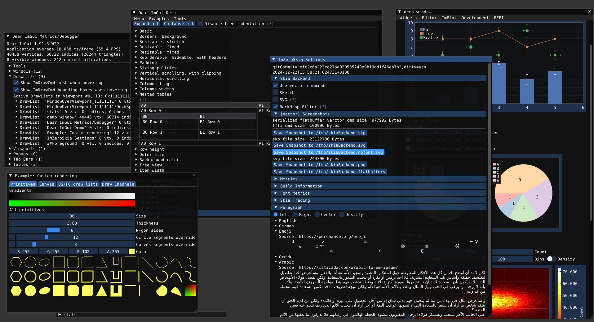

# ImZero Clients
A GUI technology with ...
* ... the [API](https://pkg.go.dev/github.com/stergiotis/boxer@v0.0.0-20241209212118-144e09d45eb3/public/imzero/imgui) and widgets of [Dear ImGui](https://github.com/ocornut/imgui) and [ImPlot](https://github.com/epezent/implot);
* ... a simple yet effective architecture similar to [React Native](https://reactnative.dev/) (pre [0.76](https://reactnative.dev/blog/2024/10/23/the-new-architecture-is-here));
* ... a [Skia](https://skia.org/) rendering backend (same as [Chrome](https://www.google.de/chrome/), [Firefox](https://www.mozilla.org/de/firefox), [Android](https://www.android.com/), [Flutter](https://flutter.dev/), [LibreOffice](https://en.libreoffice.org/)).

This repository contains the C++ code needed to render ImZero [GUI commands](./spec/ImZeroFB.fbs) and generating ImZero [user interaction events](./spec/ImZeroFB.fbs).


See [imzero.go](./go/imzero.go) for a sample driver application using the ImZero go binding [Boxer](https://github.com/stergiotis/boxer). The necessary patches for ImGui are available in [here](https://github.com/stergiotis/imgui/tree/imzero_hooks_docking).

## Screenshots
</img>
<details><summary>SVG "screenshot"</summary>
Unedited SVG (generated by Skia):

Text rendered as path:

</details>
<details><summary>For comparison: Plain ImGui renderer with Freetype</summary>

</details>
<details><summary>Sketching graphical effect filter</summary>
Screenshot:

SVG:

</details>

## Features
1) Develop **native desktop GUI** applications in managed languages (e.g. go, TypeScript) without relying on FFI, empowered by an immediate mode API (no callbacks, no retained scene-graph).
2) **Proper text layouting, shaping and rendering** by relying on the capabilities of [Skia](https://skia.org) (SkParagraph module).
3) **SVG screenshots** suitable to manual post-processing (i.e. preserves text and primitives).
4) State-of-the art **hardware accelerated** immediate mode 2D drawing by relying on [Skia](https://skia.org).

## Running the demo
Assuming Ubuntu Linux and go >=1.22 installation:
```bash
git clone https://github.com/stergiotis/imzero_client_cpp
cd imzero_client_cpp
./scripts/install.sh
./scripts/install_ubuntu2204.sh
./imgui_glfw/build.sh
./scripts/demo.sh
```
Note that this clones the go library <a href="https://github.com/stergiotis/boxer">Boxer</a> and uses a `go.mod` directive to use it in the go build.
This ensures that the generated `dispatch.h` files match the corresponding fffi idl code in boxer.

## Contributing
Currently, no third-party contributions are accepted.

## License
The MIT License (MIT) 2024 - [Panos Stergiotis](https://github.com/stergiotis/). See [LICENSE](LICENSE) for the full license text.
